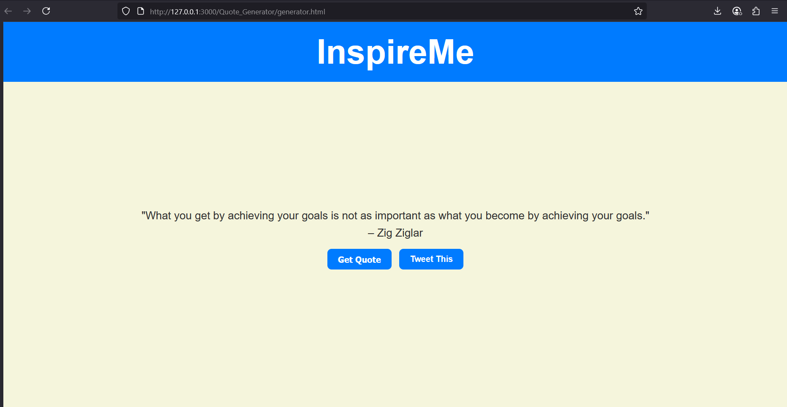

# Quote_Generator
## Date:
## Objective:
To create a simple quote generator using HTML, CSS, and JavaScript that displays a new random motivational quote each time a button is clicked — similar to daily quote sections on blogs or productivity apps.

## Tasks:

#### 1. Create the HTML Structure:
Add a heading like ```<h1>InspireMe</h1>```

Use a ```<div> or <p>``` to display the quote text.

Use another ```<p> or <span>``` to display the author’s name.

Add a button labeled “Get Quote”.

#### 2. Style the Layout Using CSS:
Center everything on the page using flexbox.

Style the quote box with padding, background color, and rounded borders.

Use a clean font (like Roboto or Open Sans).

Add hover effects for the button.

#### 3. Add JavaScript Functionality:
Store an array of quotes (objects with text and author).

On button click, generate a random index using Math.random().

Display the selected quote and author in the HTML.

Ensure each click updates the quote dynamically using innerText.

#### 4. Enhancements:
Animate the quote change using fade effects.

Add a “Tweet this” button with a share link.
## HTML Code:
```html
<!DOCTYPE html>
<html lang="en">
<head>
  <meta charset="UTF-8" />
  <meta name="viewport" content="width=device-width, initial-scale=1.0"/>
  <title>InspireMe</title>
  <link rel="stylesheet" href="styles.css"/>
  </head>
<body>
  
  <div class="header">
    <h1>InspireMe</h1>
  </div>


  <div class="content">
    <div class="quote-container">
      <p id="quoteText">"Loading..."</p>
<span id="quoteAuthor">-</span>
    

  <div class="buttons">
      <button id="newQuoteBtn">Get Quote</button>
      <a id="tweetBtn" href="#" target="_blank">Tweet This</a>
    </div>
  </div>

  <script src="scripts.js"></script>
</body>
</html>

```
## CSS Code:
```css
* {
  margin: 0;
  padding: 0;
  box-sizing: border-box;
}

body {
  font-family: 'Poppins', sans-serif;
  background-color: #f5f5dc;
  height: 100vh;
  display: flex;
  flex-direction: column;
}


.header {
  background-color: #007bff; 
  color: white;
  padding: 20px;
  text-align: center;
  font-size: 2rem;
  font-weight: 600;
}

.content {
  flex: 1;
  display: flex;
  flex-direction: column;
  justify-content: center;
  align-items: center;
  padding: 20px;
}

.quote-container {
  display: flex;
  gap: 8px;
  align-items: center;
  justify-content: center;
  flex-wrap: wrap;
  font-size: 1.3rem;
  color: #333;
  margin-bottom: 30px;
  text-align: center;
}

.quotetext {
  font-weight: 500;
}

.quoteauthor {
  font-style: italic;
  color: #555;
}


.buttons {
  display: flex;
  gap: 15px;
  flex-wrap: wrap;
  justify-content: center;
}

button, a {
  padding: 10px 20px;
  background-color: #007bff;
  color: white;
  border: none;
  border-radius: 8px;
  font-size: 1rem;
  font-weight: 600;
  text-decoration: none;
  cursor: pointer;
  transition: background-color 0.3s ease;
}

button:hover, a:hover {
  background-color: #0056b3;
}
.quote-container {
  display: flex;
  flex-direction: column;  
  align-items: center;
  justify-content: center;
  font-size: 1.3rem;
  color: #333;
  margin-bottom: 20px;
  text-align: center;
}

.quotetext {
  font-weight: 500;
  margin-bottom: 10px;
}

.quoteauthor {
  font-style: italic;
  color: #555;
}


.buttons {
  display: flex;
  gap: 15px;
  justify-content: center;
  flex-wrap: wrap;
  margin-top: 10px;
}


button, a {
  padding: 10px 20px;
  background-color: #007bff;
  color: white;
  border: none;
  border-radius: 8px;
  font-size: 1rem;
  font-weight: 600;
  text-decoration: none;
  cursor: pointer;
  transition: background-color 0.3s ease;
}

button:hover, a:hover {
  background-color: #0056b3;
}

```
## Javascript Code:
```js
const quotes = [
  { text: "Dream big and dare to fail.", author: "Norman Vaughan" },
  { text: "Turn your wounds into wisdom.", author: "Oprah Winfrey" },
  { text: "Believe you can and you're halfway there.", author: "Theodore Roosevelt" },
  { text: "What you get by achieving your goals is not as important as what you become by achieving your goals.", author: "Zig Ziglar" },
  { text: "Everything you can imagine is real.", author: "Pablo Picasso" }
];

const quoteText = document.getElementById("quoteText");
const quoteAuthor = document.getElementById("quoteAuthor");
const newQuoteBtn = document.getElementById("newQuoteBtn");
const tweetBtn = document.getElementById("tweetBtn");

function getRandomQuote() {
  return quotes[Math.floor(Math.random() * quotes.length)];
}

function displayQuote() {
  const { text, author } = getRandomQuote();
  quoteText.innerText = `"${text}"`;
  quoteAuthor.innerText = `– ${author}`;
  const tweetUrl = `https://twitter.com/intent/tweet?text=${encodeURIComponent(`"${text}" – ${author}`)}`;
  tweetBtn.href = tweetUrl;
}

newQuoteBtn.addEventListener("click", displayQuote);
displayQuote(); 

```
## Output:


## Result:
A simple quote generator using HTML, CSS, and JavaScript that displays a new random motivational quote each time a button is clicked — similar to daily quote sections on blogs or productivity apps is created successfully.
